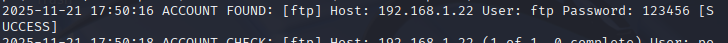
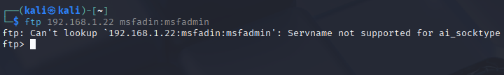
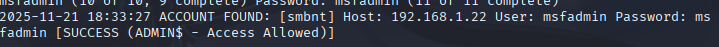
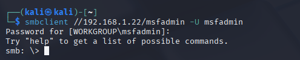
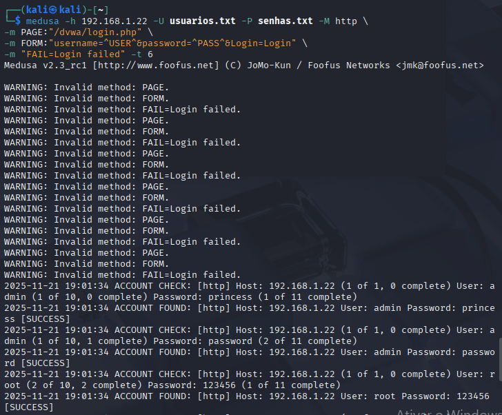

# Desafio de Projeto: Pentest com Medusa (FTP, SMB e Web)

## Descrição
Este projeto foi desenvolvido como parte do **Bootcamp de Cibersegurança do Santander** em parceria com a **DIO**. 

O objetivo foi simular um ciclo completo de ataques de força bruta (*Brute Force*) utilizando a ferramenta **Medusa** contra o ambiente vulnerável **Metasploitable 2**. O diferencial deste projeto foi a exploração de três vetores distintos de ataque: transferência de arquivos (FTP), compartilhamento de rede (SMB) e formulários web (HTTP).

## Ferramentas Utilizadas
* **Kali Linux:** Sistema Operacional ofensivo (Atacante).
* **Medusa:** Ferramenta de força bruta modular e paralela.
* **Metasploitable 2 / DVWA:** Ambientes alvo (Vítimas).
* **Smbclient:** Ferramenta para interação com servidores Samba.
* **Wordlists:** RockYou e listas personalizadas para enumeração.

## Cenários Executados

### 1. Protocolo FTP (Ataque de Dicionário)
O objetivo foi descobrir a senha do administrador do FTP e validar o acesso aos arquivos.
* **Vetor:** Porta 21 (TCP).
* **Comando:** `medusa -h [IP] -U usuarios.txt -P senhas.txt -M ftp`

**Resultados:**
A ferramenta identificou as credenciais `msfadmin:msfadmin`. Em seguida, realizei o login via terminal para comprovar a exfiltração de dados.

---

### 2. Protocolo SMB (Password Spraying)
Simulei um ataque ao serviço Samba (compartilhamento Windows). A técnica utilizada foi o *Password Spraying*, onde testamos uma senha comum contra vários usuários.
* **Vetor:** Porta 445/139 (TCP).
* **Comando:** `medusa -h [IP] -U usuarios.txt -p msfadmin -M smbnt`

**Resultados:**
Após identificar a credencial válida, utilizei o `smbclient` para acessar o diretório pessoal do usuário e listar arquivos ocultos.

---

### 3. Aplicação Web (DVWA Form Brute Force)
O cenário mais complexo envolveu a automação de preenchimento de formulário web. Foi utilizado um script no Medusa para interpretar a resposta "Login Failed" e iterar as tentativas.
* **Vetor:** Porta 80 (HTTP) - DVWA.
* **Script:** Módulo `web-form` com verificação de falha.

**Resultados:**
O ataque quebrou a autenticação do painel administrativo web.

---

## Medidas de Mitigação (Blue Team)
Sob a ótica de defesa (Blue Team), a análise técnica aponta as seguintes correções necessárias para evitar estes vetores de ataque:

1.  **Gestão de Identidade:** Eliminar credenciais padrão (`msfadmin`, `admin`) e impor Múltiplo Fator de Autenticação (MFA) em todos os serviços críticos.
2.  **Rate Limiting:** Implementar bloqueio automático de IPs após 5 tentativas falhas (ferramenta sugerida: **Fail2Ban**).
3.  **Proteção de Serviços:** * Substituir FTP por SFTP (Criptografado).
    * Desativar SMBv1 (Vulnerável a exploits como EternalBlue).
    * Implementar WAF (Web Application Firewall) para proteger formulários de login.

## Conclusão
Este laboratório demonstrou que ferramentas automatizadas conseguem comprometer múltiplos serviços em minutos se as configurações de segurança forem negligenciadas. A defesa em profundidade (*Defense in Depth*) é a única abordagem viável.

---
*Projeto realizado por Guilherme Froment para o Bootcamp Santander Cibersegurança 2025.*
